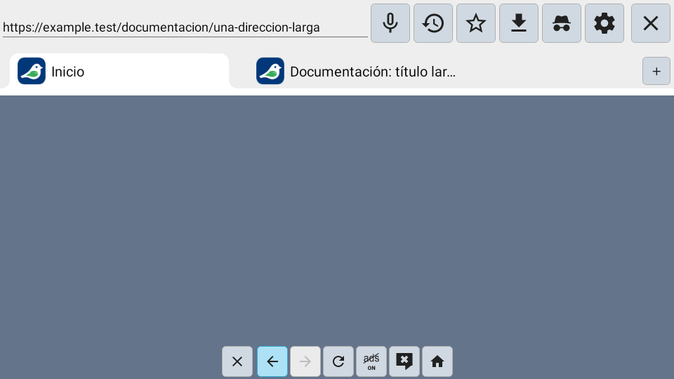
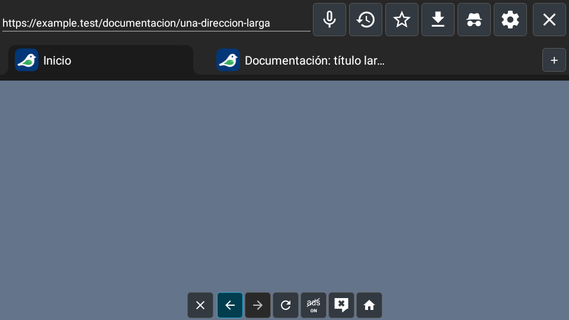

# Renovación visual TV: actualidad, rendimiento y eficiencia

Fecha: 2026-10-07. Base funcional `ba03e76`, PR #76,
rama `fixes/consolidated-audit-20261007`.

## Propuesta y alcance

[Propuesta visual](assets/UI_PROPOSAL_20261007.svg): campo de dirección con
superficie propia, controles uniformes, pestañas legibles y estados de foco
claros. Es una especificación de diseño; las capturas Android se generan desde
el XML real mediante `BrowserUiSnapshotTest` y se publican en el artefacto
`browser-ui-previews` de CI. El área web de la captura es un fondo de prueba,
no una página cargada ni una medición del renderer.

Se mantienen tema claro/oscuro, IDs, orden y comandos. No se cambian handlers
D-pad, historial, IME, fullscreen, puntero, gestión de pestañas ni callbacks.
La geometría cambia: validación de mando y lectura a distancia sigue pendiente.

| Elemento | Cambio |
| --- | --- |
| Barra superior | Botones de 48 dp, iconos existentes ajustados a 24 dp, separación uniforme y márgenes; URL de 18 sp en campo con fondo propio, mínimo de 48 dp y altura adaptable al tamaño de texto. |
| Barra inferior | Mismas siete acciones en controles de 48 dp, superficie opaca y espacio vertical/horizontal para el foco. |
| Pestañas | Fila de 48 dp, favicon de 24 dp, tipografía del sistema de 18 sp, título de una línea con ellipsis; selección/foco por formas XML. |
| Menú del puntero | Conserva botones y geometría; usa el mismo estilo y color de iconos del tema, sustituyendo el gris fijo. |
| Estados | Normal, foco, pulsado, activo y deshabilitado diferenciados; contorno de foco de 2 dp. El foco no escala ni cambia el tamaño de la vista. |
| Ajustes/controles compartidos | Paleta de tema coherente, indicadores nativos con el mismo acento y foco visible en pestañas activadas. Se conserva geometría de diálogos. |

Capturas de referencia Android con el estilo anterior:

| Claro | Oscuro |
| --- | --- |
|  |  |

Las nuevas capturas y la matriz de estados se encuentran en el artefacto
`browser-ui-previews` del check CI asociado al commit del nuevo estilo.

## Decisiones de eficiencia

- Usar Views, tipografía del sistema, vectores y formas XML. El control adblock
  sustituye el texto diminuto ON/OFF por un escudo original con marca/cruz,
  conservando los mismos recursos y significado de activación.
  No añadir bibliotecas, fuentes descargables, imágenes decorativas, blur,
  escalados de foco ni nuevos bucles/animaciones a la renovación.
- Mantener el número de vistas de los cuatro layouts. Quitar fondos redundantes
  del contenedor de URL y RecyclerView de pestañas, conservando la superficie
  que pinta el padre. Eliminar elevación de la barra y fundido de 500 ms del
  selector de pestañas de ajustes.
- La selección de pestaña usa formas en vez del recurso nine-patch anterior.
  Los recursos legacy no se eliminan como una limpieza general independiente.
- No afirmar reducción porcentual de RAM/CPU, arranque o GPU: falta medición
  comparativa de release en TV. Animaciones/indicadores existentes fuera de
  este cambio y el rendimiento del motor web siguen sujetos al plan general.

## Verificación

Referencia visual: prueba nativa publicada sobre el estilo anterior.
El primer intento `9e12e7c` falló por calificadores de prueba mal ordenados;
`e6bff56` corrige esa configuración y su
[CI 37623030100](https://github.com/ReinierTutoriales/VireoLumaTV-browser/actions/runs/37623030100)
pasa pruebas, capturas, debug, Room y release minificado. Esto no es evidencia de un fallo de la app.

La prueba de texto al 150 % detectó recorte en el campo inicialmente fijo de
48 dp: [CI 37624092386](https://github.com/ReinierTutoriales/VireoLumaTV-browser/actions/runs/37624092386),
119 pruebas, una fallida y una omitida. La altura pasa a un mínimo de 48 dp
con contenido adaptable; se conserva la aserción de texto completo y el
valor exacto de 48 dp con escala normal. No se reduce ni se fija la fuente.

La CI del tip es la aceptación automática y debe quedar verde para ese SHA.
Incluye:

- Capturas Android nativas claras/oscuras, URL larga y pestaña de título largo;
  muestra de estados normal/foco/pulsado/activo/deshabilitado.
- Tamaños de controles, ausencia de solapamientos y espacio de URL a anchos
  de prueba 720, 960 y 1280 px con densidad mdpi. No equivale a probar TVs de
  esas resoluciones físicas ni todas las densidades OEM.
- Texto ampliado al 150 %: escala del sistema aplicada y URL sin corte vertical.
- Contraste de texto/iconos activos >= 4,5:1 y contorno de foco >= 3:1,
  calculado sobre los colores efectivos de ambos temas.
- Suites existentes de navegación, fullscreen→barras, puntero, foco, tabs,
  persistencia y ajustes; JS; debug; Room sin deriva; release minificado.

Se revisan también los cambios XML: mismos IDs/orden/rutas explícitas de foco
antes/después. No sustituye la ejecución de eventos reales de las suites.

## Pendientes y reversión

Pendientes: capturas/provider reales en TV 720p/1080p/4K, overscan OEM, texto
mayor al 150 %, todas las traducciones, mando/puntero y rendimiento medido.
Las pruebas de geometría y contraste no garantizan legibilidad desde el sofá.
No se entrega una release ni se integra automáticamente el PR por este lote.

La renovación de recursos/pruebas `b8c9b2b` se puede revertir sin migración de datos.
Las capturas y ajustes de infraestructura son commits separados del estilo.

## Fuentes oficiales consultadas

- [Foco Android TV](https://developer.android.com/design/ui/tv/guides/styles/focus-system): estados e indicadores.
- [Tipografía Android TV](https://developer.android.com/design/ui/tv/guides/styles/typography): legibilidad y fuente del sistema.
- [Navegación TV](https://developer.android.com/training/tv/get-started/navigation): rutas D-pad y foco alcanzable.
- [Reducir overdraw](https://developer.android.com/topic/performance/rendering/overdraw): evitar fondos redundantes y medir en dispositivo.

Los valores específicos de tamaño/color son decisiones de diseño del proyecto;
no se presentan como garantía de rendimiento de la documentación Android.
